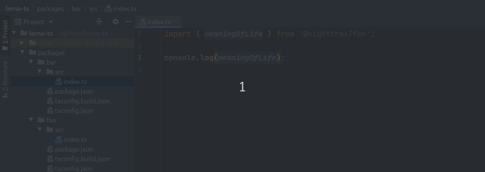
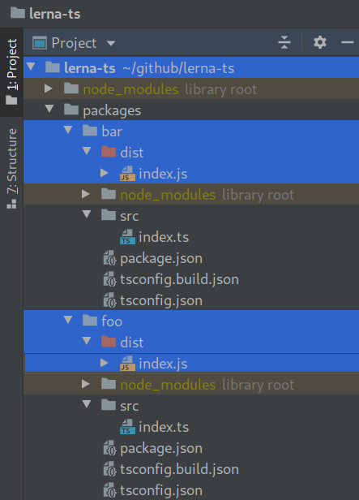

> Example TypeScript monorepo with Lerna

---

## Features

### Go to definition works without building the project

Using the "Go to definition" feature in IDEs works without needing to have up-to-date build artifacts or a watch process.



### Building packages creates the expected folder structure

Each package gets a clean build output without any artifacts from other packages.



## Setup

```shell
npm install
```
